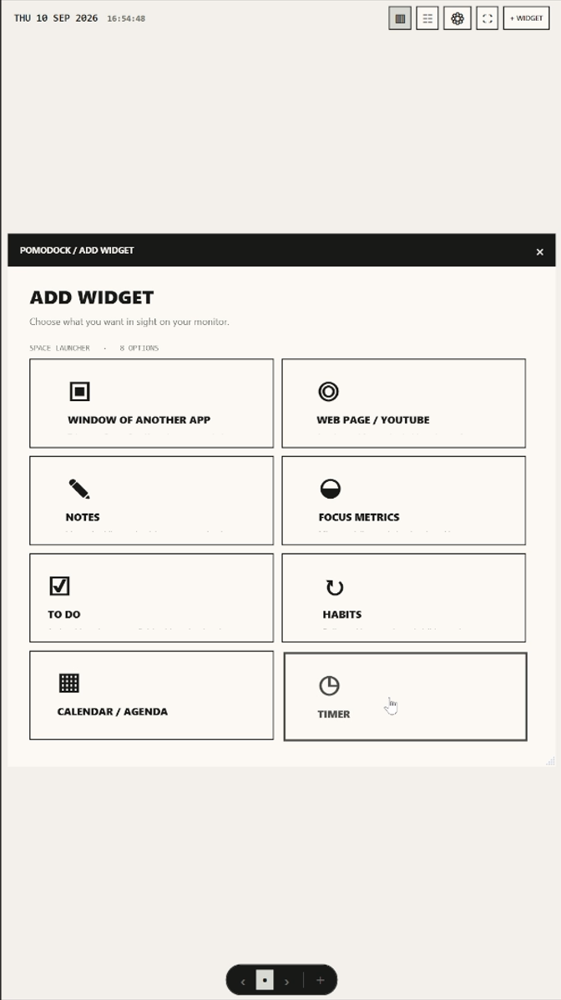
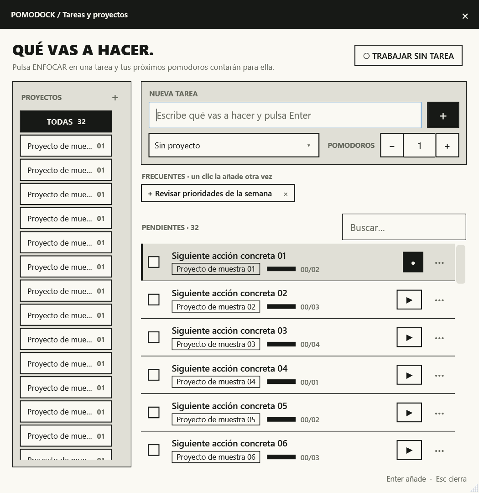
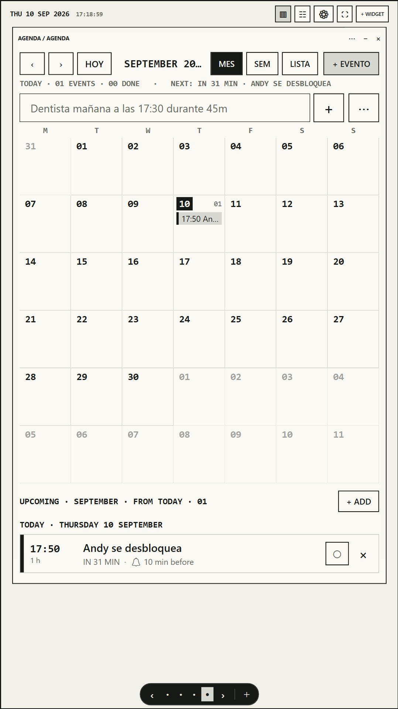
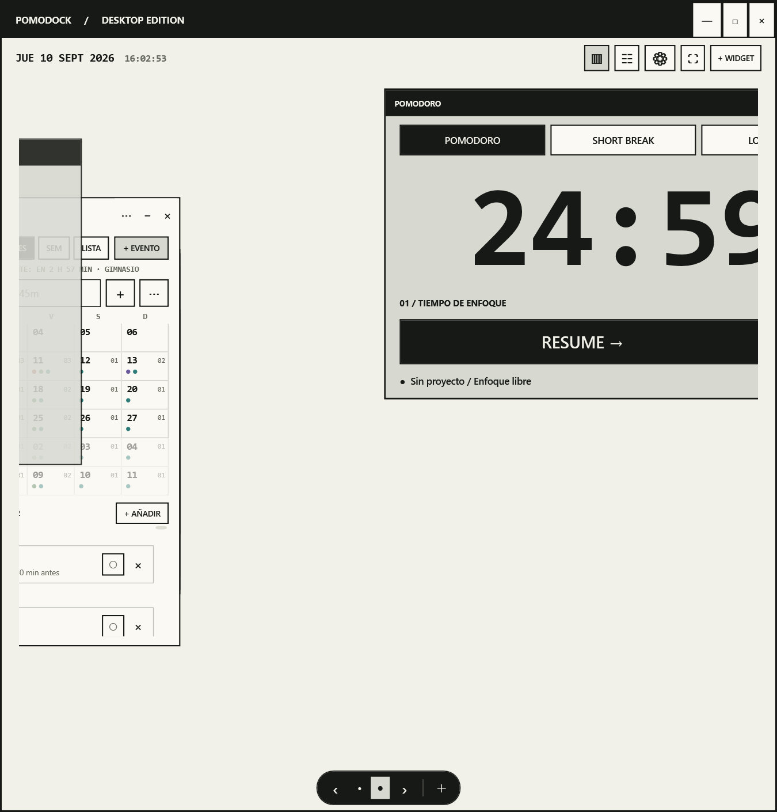
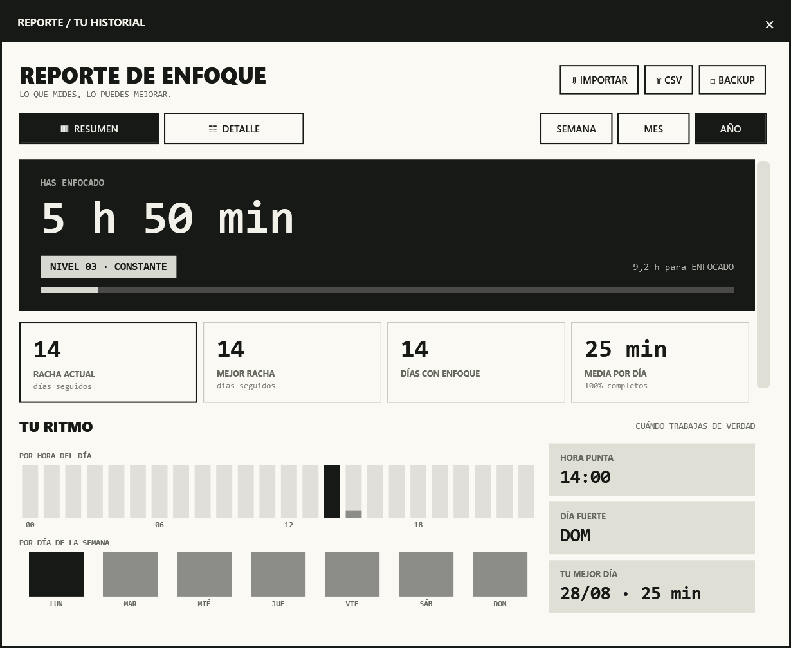
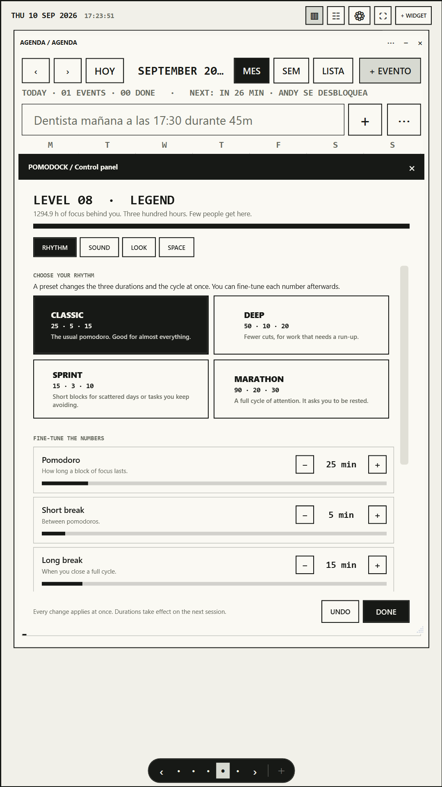
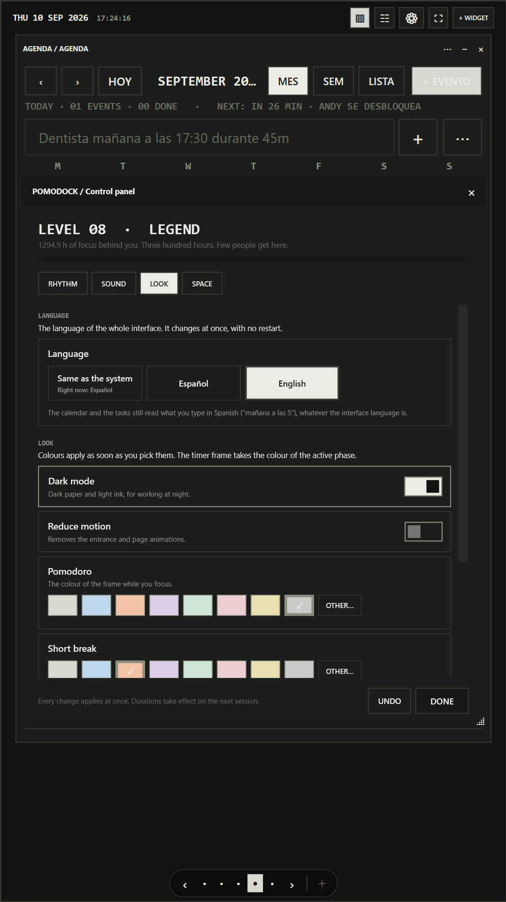

<div align="center">


# PomoDock

### Turn your vertical second monitor into a productivity workspace.

An open-source Windows canvas for focus: arrange a Pomodoro timer, tasks, habits,
notes, calendar and stats beside the real apps you already use.

[](https://github.com/TORO404DEV/focus-dock/releases/download/v0.1.0/PomoDock-Setup-0.1.0.exe)
[](https://github.com/TORO404DEV/focus-dock)
[](https://github.com/TORO404DEV/focus-dock)

[](LICENSE)
[](#install)
[](https://github.com/TORO404DEV/focus-dock/actions/workflows/ci.yml)
[](https://github.com/TORO404DEV/focus-dock)

</div>

<p align="center">
  
</p>

<!-- GIF SLOT 1: replace hero-workspace.png above with docs/media/hero-workspace.gif. -->

## Any window can become a widget

This is the idea behind PomoDock. Pick an open Windows app and place its **real,
interactive window** on your canvas. Telegram, Spotify, browsers, editors and other
desktop apps keep their own session and controls; PomoDock simply gives the window a
place beside your focus tools.

<p align="center">
  
</p>

<!-- GIF SLOT 2: replace window-to-widget.png above with docs/media/window-to-widget.gif. -->

- Search and select any visible top-level window.
- Move, resize, overlap, crop, reconnect or release it back to the desktop.
- A recovery guardian returns embedded windows if PomoDock exits unexpectedly.
- Add any HTTPS page as a WebView2 widget for YouTube, dashboards or documentation.

Window embedding is app-dependent. Some elevated or unusual DPI-mode windows may
need PomoDock to run at the same permission level, or may refuse re-parenting.

## One canvas. Your tools.

| | Native widget | What it gives you |
|---:|---|---|
| ◷ | **Pomodoro** | Moveable, resizable focus/short-break/long-break timer with configurable cycles and auto-start. |
| ☑ | **Tasks + projects** | Projects, estimates, completed pomodoros, reusable tasks, search and one-click focus. |
| ✓ | **To Do** | Priorities, dates, recurrence, filters, ordering and calendar-linked reminders. |
| ↻ | **Habits** | Daily, weekday and weekly targets with streaks, XP, levels, awards and a heat map. |
| ✎ | **Notes** | Rich sticky notes, six colours, lists, working checklists, shortcuts and searchable history. |
| ▦ | **Calendar / Agenda** | Month, week and agenda views, repeating events, reminders and natural-language quick add. |
| ◒ | **Focus stats** | Daily goal, hours, streak and a responsive week view. |
| ▥ | **Focus report** | Week/month/year charts, hover details, project totals and editable session history. |

<table>
  <tr>
    <td width="50%"></td>
    <td width="50%"></td>
  </tr>
  <tr>
    <td align="center"><strong>Tasks that feed the timer</strong></td>
    <td align="center"><strong>An agenda that stays in sight</strong></td>
  </tr>
</table>

<!-- tasks-projects.png is still the old mock-up: no real screenshot of that window yet. -->

## Pages that move like a launcher

Every page is a separate free canvas. Drag empty space sideways, use the floating
page dock, the mouse wheel over it, or `Ctrl + ← / →`. PomoDock keeps populated pages
alive and creates a blank page when you move beyond a filled edge.

<p align="center">
  
</p>

<!-- GIF SLOT 3: replace canvas-pages.png above with docs/media/canvas-pages.gif. -->
<!-- canvas-pages.png is also still the old mock-up: this one needs motion to show anyway. -->

Widgets can move freely, resize from every edge and corner, overlap, collapse, rename
or close. Layout, page, size, content and visual order persist automatically. PomoDock
also supports fullscreen on the current monitor, optional always-on-top and reduced motion.

## Focus history that stays yours

<p align="center">
  
</p>

PomoDock counts confirmed focus time, pauses across sleep and clock jumps, saves partial
sessions, and checkpoints an active session for crash recovery. Reports show focus by
week, month or year, your current and best streak, productive hours and weekdays,
project distribution, focus rank and individual sessions.

### Bring your Pomofocus history

Export your report from [Pomofocus.io](https://pomofocus.io), open PomoDock's report,
choose **Import**, and select the CSV or TSV file. Imported sessions immediately feed
reports, streaks, projects, tasks and focus rank. Re-imports are deduplicated with stable
IDs, and PomoDock creates a database safety copy before every import.

<details>
<summary><strong>Pomofocus CSV formats understood by the importer</strong></summary>

- Required columns: `date`, `project`, `task`, `hours`, `startTime`, `endTime`.
- Headers ignore case and underscores; comma and tab delimiters are detected.
- Dates: `yyyyMMdd`, `yyyy-MM-dd`, `dd/MM/yyyy`, `MM/dd/yyyy`.
- Times: 24-hour or 12-hour with AM/PM.
- Missing start/end times are inferred from duration and marked as inferred.

</details>

## Local-first by design

- **No account and no PomoDock server.** App data lives in `%LOCALAPPDATA%\PomoDock`.
- Focus history and state use a local SQLite database.
- CSV export is spreadsheet-safe; names that resemble formulas are neutralized.
- JSON backup includes settings, sessions, habits, calendar events and note history.
- JSON import merges sessions, habits, events and notes without replacing existing records.
- Embedded apps keep their original sessions in their original applications.

PomoDock is free software under the [MIT License](LICENSE). Read it, fork it and make
your workspace your own.

## Install

### Windows installer

Download **[PomoDock-Setup-0.1.0.exe](https://github.com/TORO404DEV/focus-dock/releases/download/v0.1.0/PomoDock-Setup-0.1.0.exe)**.

The installer is x64, self-contained and installs for the current Windows user. It adds
PomoDock to the Start menu, offers an optional desktop shortcut, and includes an
uninstaller. The current build is not code-signed, so Windows may identify the publisher
as unknown. Web-page widgets additionally require the Microsoft Edge WebView2 Runtime.

### Build from source

Requirements: Windows x64 and the [.NET 8 SDK](https://dotnet.microsoft.com/download/dotnet/8.0).

```powershell
git clone https://github.com/TORO404DEV/focus-dock.git
cd focus-dock
dotnet build PomoDock.sln -c Release
.\src\PomoDock.App\bin\Release\net8.0-windows\win-x64\PomoDock.exe
```

Optional Start menu shortcut:

```powershell
.\scripts\install-start-menu.ps1
```

## Start in one minute

1. Move PomoDock to your vertical or secondary monitor.
2. Press **+ Widget** and add a timer, To Do, calendar or any open app window.
3. Drag headers to arrange widgets; resize from any border or corner.
4. Select a task under the timer and press **Start** or `Space`.
5. Review the result from the report button.

Four included rhythms provide quick starting points: Classic `25·5·15`, Deep
`50·10·20`, Sprint `15·3·10`, and Marathon `90·20·30`. Durations and cycle length can
also be changed independently.

<p align="center">
  
</p>

<details>
<summary><strong>Sound, reminders and appearance</strong></summary>

PomoDock synthesizes 36 sounds in code: separate focus and break alarms, calendar
chimes, button packs and focus ambience including white/pink/brown noise, rain, storm,
waves, wind, stream, fireplace, fan, clock and binaural alpha. Sounds mix without
interrupting ambience; ambience loops are crossfaded. Volume and repeat count are
configurable.

Calendar reminders work while PomoDock is open even when their widget is on another
page or the app is minimized. Notifications support done and 5/15-minute snooze.

The control panel groups rhythm, sound, appearance and workspace settings. It includes
light/dark themes, phase colours, live previews and one-click undo for the current visit.
The interface ships in English and Spanish and can follow the Windows language.

Every text field also has private, local Whisper dictation. The multilingual model is
downloaded once, then transcription stays on the computer and is forced to the effective
Spanish or English language selected in Settings instead of guessing from Windows.
On compatible Windows PCs it uses Vulkan GPU acceleration and keeps the model warm in memory;
the CPU runtime remains packaged as a fallback.
While recording, the microphone shows elapsed time, input level and progressive local transcript
previews; the final stable result is inserted at the caret when recording stops.

<p align="center">
  
</p>

</details>

<details>
<summary><strong>Keyboard shortcuts</strong></summary>

| Shortcut | Action |
|---|---|
| `Space` | Start or pause the timer when no text field is active |
| `Ctrl + ← / →` | Previous or next workspace page |
| `F11` | Fullscreen on the current monitor |
| `Esc` | Leave fullscreen or close the active modal |
| `1–8` | Choose a widget in the launcher |
| `Ctrl + B / I / U` | Bold, italic or underline in notes |
| `Ctrl + Shift + X` | Strikethrough in notes |
| `Ctrl + Shift + C` | Toggle a checklist line in notes |
| `Ctrl + Z / Y` | Undo or redo in notes |

</details>

## Built for Windows

| Layer | Technology |
|---|---|
| Desktop UI | WPF on .NET 8, per-monitor DPI aware |
| Embedded apps | Win32 re-parenting with a recovery journal and guardian process |
| Web widgets | Microsoft Edge WebView2 with an isolated local profile |
| Storage | SQLite with JSON payloads |
| Audio | Deterministic synthesized PCM mixed locally |

The core library has no UI dependency. Timer accounting, recurrence, imports, habits,
backups, notes and sound generation are covered by the test runner. GitHub Actions builds
the solution and runs the tests on every push and pull request.

## Contributing

1. Fork the repository and create a focused branch.
2. Run `dotnet build PomoDock.sln -c Release`.
3. Run `dotnet run --project tests/PomoDock.Tests -c Release`.
4. For UI changes, run the native smoke test:

```powershell
.\src\PomoDock.App\bin\Release\net8.0-windows\win-x64\PomoDock.exe --self-test C:\temp\pomodock-test
```

The smoke test uses disposable windows and writes `results.json` plus PNG captures. Pull
requests, focused bug reports and compatibility reports for embedded apps are welcome.

## Support PomoDock

PomoDock has no sponsorship or donation program today. The most useful support is to
**[star the repository](https://github.com/TORO404DEV/focus-dock)**, share it with someone
who owns an underused second monitor, report a bug, or contribute a fix.

<div align="center">

### If PomoDock earned a place on your monitor, help someone else find it. ★

[](https://github.com/TORO404DEV/focus-dock)

[MIT](LICENSE) © 2026 [TORO404DEV](https://github.com/TORO404DEV)

</div>
