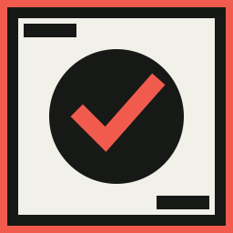
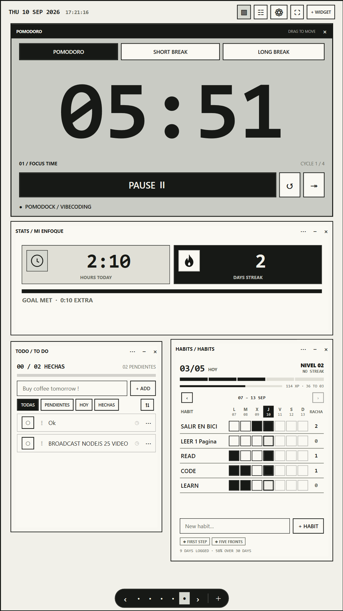

<div align="center">



# PomoDock

**Your second monitor, as a focus workspace.**

Open-source Windows canvas for Pomodoro, tasks, habits, notes, calendar, finance,
embedded apps—and a private agent that can run them.

[](https://github.com/TORO404DEV/focus-dock/releases/download/v0.2.1/PomoDock-Setup-0.2.1.exe)
[](LICENSE)
[](https://github.com/TORO404DEV/focus-dock/actions/workflows/ci.yml)

[Website](https://pomodock.com) · [Releases](https://github.com/TORO404DEV/focus-dock/releases) · [★ Star](https://github.com/TORO404DEV/focus-dock)

</div>

<p align="center">
  
</p>

## What it is

A brutalist, local-first workspace meant for a **vertical second monitor**.
You arrange widgets on free canvases (pages on an infinite grid), keep real Windows
windows as widgets, and optionally talk to an agent that plans actions and waits for
your confirmation before changing anything.

| | |
|---|---|
| **Pomodoro** | Focus / short / long, rhythms, sounds, focus history |
| **Pages** | Infinite grid; drag empty space or use the page dock |
| **Widgets** | Tasks, To Do, habits, notes, calendar, finance, stats, web |
| **Windows** | Embed a live Windows app (or an HTTPS page) on the canvas |
| **Agent** | Voice or chat; DeepSeek when configured; tools stay local |
| **Yours** | No account. Data in `%LOCALAPPDATA%\PomoDock` |

Window embedding depends on the target app (elevation / DPI). Web widgets need
[WebView2](https://developer.microsoft.com/microsoft-edge/webview2/).

## Install

Download **[PomoDock-Setup-0.2.1.exe](https://github.com/TORO404DEV/focus-dock/releases/download/v0.2.1/PomoDock-Setup-0.2.1.exe)**
(Windows x64, current user, Start Menu entry). The build is not code-signed; Windows may
warn about an unknown publisher. If **Smart App Control** is on, unsigned local rebuilds
can be blocked—turn SAC off for development, or use a signed release.

### From source

Requires Windows x64 and the [.NET 8 SDK](https://dotnet.microsoft.com/download/dotnet/8.0).

```powershell
git clone https://github.com/TORO404DEV/focus-dock.git
cd focus-dock
dotnet build PomoDock.sln -c Release
.\scripts\install-start-menu.ps1
```

Then open **PomoDock** from the Start menu.

## Start fast

1. Move the window to your secondary / vertical monitor.
2. **+ Widget** — timer, tools, web, or another app’s window.
3. Arrange freely; pages persist automatically.
4. Start focus from the timer (`Space` when no text field is focused).
5. Optional: open the agent, set a DeepSeek API key in Settings, talk or type.

## Agent (0.2)

The agent can search and change todos, habits, notes, calendar, finance, widgets,
pages (including rename / home), layouts, sounds and settings through typed tools.
Destructive steps ask for confirmation. Limits that stay out of reach on purpose
(HWND picker, minimize/close the app shell, etc.) are listed in
[`docs/AGENT_ACTIONS.md`](docs/AGENT_ACTIONS.md).

## Stack

WPF on .NET 8 · SQLite · WebView2 · Win32 embedding · synthesized audio · Whisper dictation · DeepSeek for agent chat (optional)

## Contributing

```powershell
dotnet build PomoDock.sln -c Release
dotnet run --project tests/PomoDock.Tests -c Release
```

UI smoke test:

```powershell
.\src\PomoDock.App\bin\Release\net8.0-windows\win-x64\PomoDock.exe --self-test C:\temp\pomodock-test
```

## License

[MIT](LICENSE) © 2026 [TORO404DEV](https://github.com/TORO404DEV)
