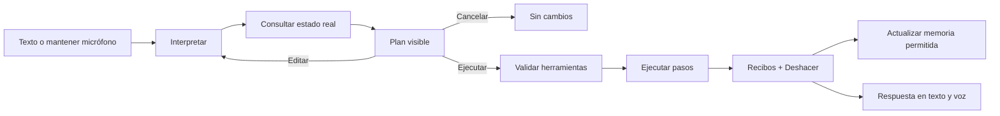

# Plan maestro: agente local de PomoDock

Estado: **Fases 0–7 completadas (0.2.0)**  
Fecha: 2026-09-11  
Objetivo: convertir el agente actual en una experiencia de IA local, conversacional, observable, rápida y capaz de trabajar con todo PomoDock sin romper su lenguaje visual.

## 1. Punto de partida y problemas observados

La primera versión demuestra que el enfoque local funciona: Qwen 3 corre mediante Vulkan en la RX 580, el agente puede invocar herramientas tipadas y la voz neuronal funciona sin una API. Antes de ampliar funciones hay que corregir la base.

Problemas confirmados:

1. **Acceso incompleto a los datos.** `get_state` no expone `Store.Sessions()`. Por eso preguntas como “¿cuántas horas enfoqué el mes pasado?” no pueden responderse aunque PomoDock sí tenga esos datos.
2. **Bucle sin detector de estancamiento.** El modelo puede repetir una consulta que no le entrega lo necesario hasta agotar los 10 pasos.
3. **Conversación efímera.** Cada orden crea un contexto nuevo; el agente no conserva el hilo ni sabe qué dijo el usuario antes.
4. **UI de formulario, no de chat.** La respuesta aparece solamente al terminar. No hay streaming, plan previo, estados de herramientas, reintento ni edición del plan.
5. **Actividad demasiado opaca.** El usuario solo ve “trabajando” o un error final. No puede distinguir entre interpretar, consultar, planear, ejecutar y hablar.
6. **Dictado con estados duplicados.** La transcripción provisional aparece en el input y también en feedback separado; el botón y el gesto no se sienten como una nota de voz.
7. **Memoria inexistente.** No hay identidad, preferencias, proyectos personales ni recuerdos explícitos gestionables.
8. **Cobertura de acciones parcial.** Predominan “añadir/completar/eliminar”; faltan consultas analíticas y operaciones de editar, buscar, mover, resumir, reprogramar y deshacer.

## 2. Principios no negociables

- **Local primero.** Modelo, voz, memoria, historial y herramientas funcionan sin Internet ni API key.
- **Plan antes de mutar.** El agente interpreta y muestra un plan concreto antes de cambiar datos. El usuario puede ejecutar, editar o cancelar.
- **Hechos antes que prosa.** Las respuestas sobre PomoDock proceden de herramientas y datos reales, no de la memoria estadística del modelo.
- **Observable, no invasivo.** Mostraremos un resumen útil de intención, plan, consultas y acciones. No mostraremos razonamiento interno crudo ni texto oculto del modelo.
- **Acciones tipadas y limitadas.** El modelo propone; una capa determinista valida esquema, permisos y precondiciones antes de ejecutar.
- **Reversible por defecto.** Toda mutación no destructiva genera un recibo y una operación de deshacer. Borrar o archivar exige confirmación.
- **Privacidad comprensible.** El usuario puede ver, editar, olvidar y exportar toda memoria guardada.
- **Una sola fuente visual.** Un estado aparece una vez: una transcripción provisional, un indicador de actividad y un resultado final.
- **Mismo PomoDock.** Papel, tinta, bordes fuertes, tipografía monoespaciada y contraste actual; más sofisticado no significa cambiar de identidad.

## 3. Experiencia objetivo

Ejemplo:

> “Antes del lunes recuérdame registrar materias y ponlo como prioridad alta.”

El chat debe mostrar:

1. **Entendí:** registrar materias antes del lunes; la fecha límite efectiva es el domingo.
2. **Plan:** crear una tarea de prioridad alta para el domingo; usar la hora predeterminada de recordatorios.
3. **Cambio previsto:** 1 tarea nueva.
4. Botones **EJECUTAR**, **EDITAR PLAN** y **CANCELAR**.
5. Al ejecutar: progreso por paso, recibo verificable y botón **DESHACER**.

Las consultas de solo lectura también generan un plan compacto, pero pueden continuar automáticamente después de mostrarlo. Esto conserva fluidez sin ocultar qué datos se consultan.

## 4. Arquitectura propuesta

Separar el agente en cinco piezas, cada una comprobable de forma independiente:

### 4.1 Conversación

- Conserva mensajes, resúmenes y referencias durante una conversación.
- Emite eventos incrementales: `interpreting`, `reading`, `plan_ready`, `executing`, `tool_result`, `answer_delta`, `speaking`, `done`, `failed`.
- Compacta el historial cuando crece; no reinyecta todo el chat en cada turno.
- Permite detener, regenerar y continuar una respuesta.

### 4.2 Planificador

- Primera inferencia: intención + datos requeridos + plan estructurado.
- No ejecuta herramientas de escritura.
- Produce un `AgentPlan` con pasos, riesgo, dependencias y cambios previstos.
- Pregunta solo cuando falta una decisión que alteraría materialmente el resultado.

### 4.3 Ejecutor

- Recibe únicamente un plan aprobado.
- Resuelve cada paso contra herramientas tipadas.
- Deduplica llamadas mediante una huella de acción.
- Detecta estancamiento tras dos resultados equivalentes y explica qué dato o capacidad falta.
- Límite adaptable: no un “10” ciego; presupuesto por plan con máximo duro de seguridad.
- Transacción lógica: si un paso esencial falla, no afirma que el plan quedó completo.

### 4.4 Catálogo de herramientas

Dividir las herramientas por dominio y usar identificadores estables, no coincidencias ambiguas de texto.

- `focus.query_sessions`, `focus.summarize`, `focus.compare_periods`, `focus.list_projects`
- `todo.search`, `todo.create`, `todo.update`, `todo.complete`, `todo.delete`
- `calendar.search`, `calendar.create`, `calendar.update`, `calendar.reschedule`, `calendar.complete`, `calendar.delete`
- `habits.search`, `habits.create`, `habits.mark`, `habits.update`, `habits.archive`
- `notes.search`, `notes.create`, `notes.append`, `notes.format`, `notes.check`
- `workspace.list`, `workspace.add_widget`, `workspace.move_widget`, `workspace.open`
- `timer.inspect`, `timer.start`, `timer.pause`, `timer.reset`, `timer.configure`
- `settings.read`, `settings.update`
- `memory.search`, `memory.propose`, `memory.forget`

Las consultas analíticas se calculan en C# con `Reports` y `Store.Sessions()`; el modelo solo decide qué consulta necesita y redacta el resultado devuelto.

### 4.5 Memoria local

Tres niveles distintos:

1. **Memoria de trabajo:** mensajes y resultados de la conversación abierta.
2. **Memoria episódica:** resúmenes de decisiones o interacciones relevantes, con fecha y origen.
3. **Memoria personal:** hechos estables y explícitos: nombre, preferencias, horarios, proyectos, forma de trabajo y reglas personales.

Cada recuerdo tendrá:

- ID, tipo, contenido, fecha, origen y nivel de confianza.
- Estado `propuesto`, `confirmado` o `olvidado`.
- Etiquetas y fecha de última utilización.
- Campo de sensibilidad para impedir inferencias o guardado automático de datos delicados.

Persistencia propuesta: tablas SQLite dentro del directorio de datos actual. Los campos sensibles se protegen con DPAPI del usuario de Windows. La búsqueda comienza con texto completo local; una segunda etapa puede añadir embeddings ONNX locales si las mediciones demuestran que aportan valor.

Reglas de memoria:

- “Recuerda que me llamo…” crea un recuerdo explícito y muestra confirmación.
- El agente puede **proponer** recordar una preferencia repetida, nunca guardarla silenciosamente.
- “¿Qué sabes de mí?” abre una vista legible y editable.
- “Olvida…” elimina el recuerdo elegido y confirma el resultado.
- Nunca se usa memoria como sustituto de datos actuales de PomoDock.
- La memoria se puede exportar, desactivar o borrar completamente desde Settings.

## 5. Nuevo chat: UI/UX

El modal actual se convertirá en una sala de conversación dentro de la capa visual de PomoDock.

### Estructura

- Cabecera compacta: nombre, estado local, backend activo y voz.
- Historial con mensajes agrupados, timestamps discretos y ancho de lectura controlado.
- Tarjeta de plan entre la petición y la ejecución.
- Línea de actividad desplegable con consultas y herramientas, sin mostrar razonamiento interno.
- Respuesta que aparece progresivamente, con cursor de streaming.
- Recibos de acciones como elementos propios, no texto pegado al mensaje.
- Composer fijo al fondo, autoexpandible, con adjuntos futuros, micrófono y enviar.
- Acciones por mensaje: copiar, reintentar, editar petición y deshacer.
- Error completo dentro del hilo, con **DETALLES**, **REINTENTAR** y **COPIAR ERROR**; no depender de una línea truncada en la cabecera.

### Estados visibles

- `INTERPRETANDO`
- `CONSULTANDO · HISTORIAL DE ENFOQUE`
- `PLAN LISTO`
- `EJECUTANDO · PASO 02/03`
- `RESPONDIENDO`
- `HABLANDO`
- `CANCELADO` o `NECESITO TU DECISIÓN`

El estado debe actualizarse en menos de 100 ms desde la interacción, aunque la inferencia tarde más.

## 6. Dictado: gesto de nota de voz

### Interacción principal

- **Mantener presionado el micrófono:** empieza a grabar inmediatamente.
- Mientras se mantiene: el botón se expande en una banda con tiempo, forma de onda y texto parcial dentro del mismo composer.
- **Soltar:** finaliza, estabiliza la transcripción y la deja escrita en el input.
- Opción en Settings: soltar puede **insertar** o **enviar al agente**.
- **Arrastrar a la izquierda:** cancelar, con feedback claro y sin conservar audio.
- **Deslizar hacia arriba:** bloquear grabación para dictados largos; después aparece un botón único de detener.
- Toque corto: muestra una pista de “mantén presionado para hablar”, sin iniciar/parar accidentalmente dos procesos.

### Simplificación técnica

- Una máquina de estados: `idle → holding → recording → finalizing → ready`, con ramas `cancelled` y `failed`.
- Una sola transcripción provisional, directamente en el input; se eliminan preview y feedback duplicados.
- Separar texto estable de hipótesis inestable para que las palabras confirmadas no salten.
- VAD local para ignorar silencio y cerrar frases sin procesar audio vacío.
- Un productor de audio y un consumidor Whisper; nunca dos procesamientos finales sobre el mismo buffer.
- Cancelación y disposición serializadas para impedir `cannot dispose while processing`.
- Accesibilidad equivalente: mantener `Espacio` sobre el botón y alternativa de grabación bloqueada.

### Objetivos medibles en este equipo

- Feedback visual del micrófono: menos de 50 ms.
- Primera transcripción parcial: objetivo menor a 900 ms.
- Actualizaciones parciales: cada 400–700 ms, sin duplicados.
- Texto final después de soltar en audio corto: objetivo menor a 1.5 s.
- Ningún audio temporal persiste después de finalizar o cancelar.

## 7. Respuesta en vivo y voz

- Separar la generación del modelo en eventos de texto y evento JSON completo.
- En consultas, mostrar la respuesta conforme llega.
- En acciones, transmitir primero el plan estructurado; ejecutar solo tras aprobación.
- Sintetizar por oraciones: mientras el agente genera la segunda oración, sherpa-onnx puede preparar y reproducir la primera.
- Interrumpir la voz al hablar de nuevo, cancelar o cerrar.
- Conservar el texto íntegro aunque la reproducción falle.
- Controles de voz en Settings: activada, idioma automático, velocidad y volumen.

## 8. Seguridad, permisos y deshacer

- Nivel 0: leer estado; no requiere confirmación adicional.
- Nivel 1: crear, editar, iniciar temporizador; requiere plan visible y ejecución del usuario.
- Nivel 2: completar en lote, cambiar Settings o reprogramar varias entradas; muestra diff resumido.
- Nivel 3: borrar, archivar o limpiar; confirmación explícita por acción o grupo homogéneo.
- Cada acción escribe un `AgentReceipt` con parámetros normalizados, resultado y operación inversa cuando exista.
- **DESHACER** debe ejecutar la inversa determinista; no pedir al modelo que “adivine” cómo revertir.
- El agente nunca recibe acceso arbitrario al sistema de archivos, shell o red.

## 9. Fases de implementación

### Fase 0 — Fiabilidad y acceso real

- [x] Añadir herramientas de historial de enfoque y agregaciones por rango.
- [x] Implementar deduplicación y detector de estancamiento.
- [x] Diferenciar consulta, conversación y mutación.
- [x] Sustituir errores de “demasiados pasos” por diagnóstico accionable.
- [x] Añadir pruebas para “último mes”, “esta semana”, proyectos y periodos sin sesiones.

**Salida:** el caso mostrado en la captura responde con las horas reales y nunca entra en bucle.

Resultado verificado el 2026-09-11: `focus.summarize` y `focus.query_sessions` consultan `Store.Sessions()` con rangos locales deterministas; Qwen asignó correctamente “último mes” a `last_month`; las acciones repetidas quedan bloqueadas y la aplicación superó 77 pruebas de núcleo y 154 pruebas visuales.

### Fase 1 — Planificador y ejecución aprobada

- [x] `AgentPlan`, pasos, riesgo y cambios previstos.
- [x] Separar `InterpretAsync` de `ExecuteAsync`.
- [x] EJECUTAR / EDITAR PLAN / CANCELAR.
- [x] Recibos y deshacer determinista (`UndoAsync`).

**Salida:** ninguna escritura ocurre antes de que el plan sea visible y aprobado.

### Fase 2 — Chat profesional y streaming

- [x] `AgentWindow` con chrome de PomoDock.
- [x] Historial persistente (20 hilos).
- [x] Actividad en vivo; tokens sin CoT crudo (`AgentThink`).
- [x] Errores con DETALLES / REINTENTAR / COPIAR ERROR.
- [x] Recibos + DESHACER en el hilo.

**Salida:** la interacción se siente como un chat de IA y sigue pareciendo PomoDock.

### Fase 3 — Push-to-talk

- [x] Mantener / soltar / arrastrar fuera para cancelar.
- [x] Preview único en el compositor (VoiceDictation ignora `agent-composer`).
- [x] Toque corto no graba; Espacio equivale a mantener.
- [x] Enviar al soltar como opción en Settings.

**Salida:** dictar se siente como enviar una nota de voz, sin doble preview.

### Fase 4 — Memoria personal local

- [x] SQLite `agent.memory` + DPAPI en campos sensibles.
- [x] Recuerda que / Olvida / ¿Qué sabes de mí?
- [x] Recuérdame es una tarea, no un recuerdo.
- [x] Inspector en Settings: olvidar, exportar, desactivar.

**Salida:** PomoDock recuerda información autorizada entre reinicios.

### Fase 5 — Cobertura completa de PomoDock

- [x] Tools: focus, todo, calendar, habits, notes, workspace, timer, settings, memory, finance.
- [x] Horas de enfoque solo vía `Store.Sessions()` / `FocusHistory`.
- [x] Preguntas de horas del último mes se responden en C#, sin inventar.
- [x] Widget Finanzas + `finance.*`.

**Salida:** el agente opera lo que PomoDock expone, sin inventar capacidades.

### Fase 6 — Evaluación y pulido

- [x] Tests Core: GGUF, bucle, memoria, chats, think-strip, intención, finanzas, rangos.
- [x] Anti-bucle: dos repeticiones detienen el plan.
- [x] Cerrar durante inferencia/voz/mic cancela y no deja WAV huérfanos.

**Salida:** versión instalable y autocontenida.

### Fase 7 — Empaque 0.2.x

- [x] Tests Core en verde.
- [x] Versión **0.2.0**.
- [x] Cerrar PomoDock → publish win-x64 → instalador.
- [x] Commits claros en `main` (canvas 2D conservado).

## 10. Orden exacto del primer corte

1. [x] `focus.query_sessions` y `focus.summarize` usando `Store.Sessions()`.
2. [x] Detector de acciones repetidas y estancamiento.
3. [x] Contrato `AgentPlan` separado del ejecutor.
4. [x] Bus de eventos incrementales del agente.
5. [x] Chat con tarjeta de plan y actividad en vivo.
6. [x] Push-to-talk con preview único.
7. [x] Persistencia de conversación.
8. [x] Memoria personal explícita y administrable.

## 11. Criterios de aceptación globales

- [x] “¿Cuánto enfoqué el mes pasado?” se calcula en C# y nombra el rango.
- [x] “Recuérdame…” es tarea; “Recuerda que…” es memoria.
- [x] Una escritura muestra EJECUTAR / EDITAR / CANCELAR antes de mutar.
- [x] Cancelar el plan no llama al ejecutor.
- [x] DESHACER usa la inversa del recibo, no el modelo.
- [x] El chat se restaura al reabrir el modal.
- [x] Memoria confirmada sobrevive el reinicio; olvida/exporta desde Settings.
- [x] “¿Qué sabes de mí?” lista solo recuerdos visibles.
- [x] Mantener/soltar el micrófono deja una sola transcripción en el compositor.
- [x] El GGUF ya descargado no se vuelve a pedir.
- [x] Español e inglés cubren las mismas herramientas.

## 12. Decisiones cerradas en 0.2.0

- Consultas de solo lectura (sobre todo enfoque) avanzan solas; las mutaciones esperan clic.
- Soltar el micrófono **inserta** por defecto; enviar al soltar es un toggle.
- Se conservan las 20 conversaciones recientes.
- Memoria: búsqueda textual y etiquetas, sin embeddings.
- La voz habla la respuesta si el toggle ◉ VOZ está encendido.

## 13. Cómo probar 0.2.0

1. **Horas del último mes.** Abre ✦. Si `Qwen3-4B-Q4_K_M.gguf` ya está en `%LOCALAPPDATA%\PomoDock\models\`, no pide 2.5 GB. Pregunta: «¿Cuántas horas enfoqué el último mes?». La cifra sale de las sesiones reales; el rango es el mes calendario anterior.
2. **Mutación con aprobación.** «Recuerda que prefiero sesiones de 50 minutos». Aparece el plan. CANCELAR no toca datos. EJECUTAR escribe; DESHACER revierte.
3. **Modelo reutilizado.** Cierra y abre el agente: LISTO + backend, sin descarga si el GGUF está completo. Whisper (`ggml-*.bin`) no cuenta como LLM.
4. **Finanzas.** Lanzador → FINANZAS. `+2500 salario`, `-20 chatgpt`, `sub cursor 20`, `fijo renta 800`, PAGADO en SUBS.
